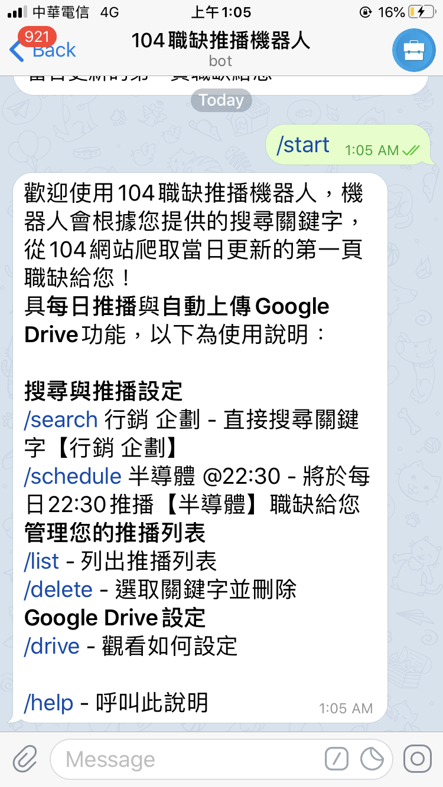

  
  <h2 align="center">104職缺推播機器人</h2>
    

     幫朋友做好玩的Telegram機器人，已部署到Heroku上，歡迎玩壞（？）
  

   	

     點擊加入 <a href="https://t.me/job_scraper_bot">https://t.me/job_scraper_bot</a>

    

## Table of contents
* [Application Demo](#application-demo)
* [Introduction](#introduction)

## Application Demo
### [104職缺推播機器人 – Demo (YouTube)](https://www.youtube.com/watch?v=)

<a href=>
    <imjlhlkg src="resources/asdfasdf.gif" alt="demo" width="720" height="450">
</a>

## Introduction
機器人的功能很簡單不再贅述，稍微說明一下程式要點，讓同為新手剛好查到這篇的朋友可以參考一下

* 使用[python-telegram-bot](https://github.com/python-telegram-bot/python-telegram-bot/tree/fd0325fbe5c79b14b2a78ba1a7ad93554eb8b2a6)建構機器人
* 對104進行爬蟲（不是很重要XD）
* 使用[PyDrive](https://pythonhosted.org/PyDrive/)處理Google Drive
* 將資料儲存在[AWS S3](https://s3.console.aws.amazon.com/s3)上
* 部署在[Heroku](https://www.heroku.com/)上

### Telegram API
**Important** - 建議先看過這個Tutorial - [Telegram Bot with Python (CoinMarketCap)](https://www.youtube.com/playlist?list=PLe4mIUXfbIqbpQkE2Q_iQic6a8v-2k_m4)，先用Flask建構機器人並對Telegram API有一定的認識後再使用wrapper

* 本機器人使用python-telegram-bot wrapper建構
* 參考該文件的範例即可做出一個機器人 [Tutorial: Your first Bot](https://github.com/python-telegram-bot/python-telegram-bot/wiki/Extensions-%E2%80%93-Your-first-Bot) (記得先找[@BotFather](https://telegram.me/botfather))
* 注意該範例的機器人使用的是較適用於測試的getUpdates，而非Webhook，可以使用[Serveo](https://serveo.net/)或是[ngrok](https://ngrok.com/)服務架設暫時的Webhook，稍後會提到部署在Heroku時的Webhook設定

### 104爬蟲
* 請參考[此篇104爬蟲教學](https://www.royenotes.com/python%e7%88%ac%e5%8f%96104%e4%ba%ba%e5%8a%9b%e9%8a%80%e8%a1%8c%e7%9a%84%e8%81%b7%e7%bc%ba%e8%a8%8a%e6%81%af/)

### Google Drive

* 欲讓程式連結到Google Drive，要先到[Google APIs](https://console.developers.google.com/apis/)開通憑證，詳細可見[此教學](https://jackkuo.org/post/pydrive%E5%82%99%E4%BB%BD%E6%95%99%E5%AD%B8/)
* [client_secrets.json](https://github.com/wenyalintw/Job-Scraper-Bot/tree/master/src/client_secrets.json)即是開通憑證後所得
* 使用PyDrive處理驗證與上傳檔案等事項
* 使用者將自身Google Drive權限開給機器人後，機器人會存下`CredentialsFile`，日後即不須再次驗證，取消授權即會刪除該檔案

### AWS S3
* 我選擇將程式Deploy在Heroku，但Heroku是[Ephemeral File System](https://www.codementor.io/@samueljames/a-workaround-heroku-s-ephemeral-file-system-e6w341zqa)，也就是每次重啟dyno後程式生成的檔案會被清掉
* 所以將使用者訂閱的關鍵字還有Google Drive憑證等資料存在AWS S3
* 到S3取得憑證並建立Bucket後即可使用[boto3](https://boto3.amazonaws.com/v1/documentation/api/latest/index.html)套件進行操作

### Heroku
* Heroku部署方法可以先看[此教學](https://www.youtube.com/watch?v=wWRYBUzEG6E)
* 使用Heroku部署python-telegram-bot之機器人，參考[此範例](https://github.com/Eldinnie/ptb-heroku-skeleton)設定webhook等
* 由於此機器人有使用時間設定，但Heroku的時區為UTC+0，參考[這篇教學](https://medium.com/@rnnnnn/%E5%9C%A8-heroku-%E8%A8%AD%E5%AE%9A%E6%99%82%E5%8D%80-timezone-3d83c5835740)更改Heroku時區
* 若使用Heroku免費版帳號，若app超過30分鐘沒被造訪，系統會自動進入休眠，會造成下一次造訪的時間延遲（並且排程的推播也不會運行...）
	* 解法：設定每25分鐘對Heroku app的網址發出GET請求，以迫使機器人不進入休眠

###### MIT License (2020), Wen-Ya Lin